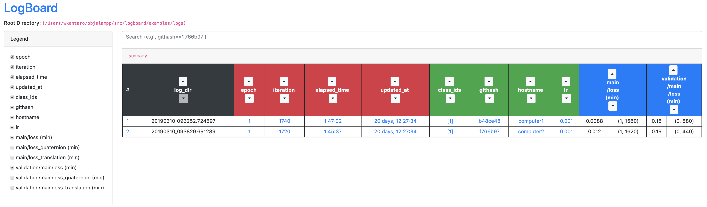
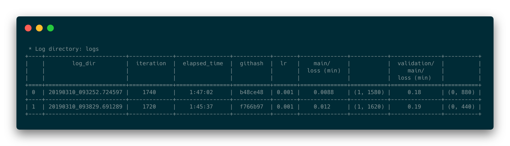

<h1 align="center">
  logboard
</h1>

<h4 align="center">
  Monitor and Compare Logs on Browser/Terminal.
</h4>

<div align="center">
  <a href="https://pypi.python.org/pypi/logboard"></a>
  <a href="https://pypi.org/project/logboard"></a>
  <a href="https://travis-ci.com/wkentaro/logboard"></a>

  <br/>

  
  
</div>


## Description

Inspired by [tensorboard](https://github.com/tensorflow/tensorboard),
[grip](https://github.com/joeyespo/grip) and [notable](https://github.com/notable/notable),
all of which serve light-weight GUI by

- only using static files (e.g., markdown files without DB);
- single command (e.g., `tensorboard --logdir logs/` and `grip README.md`).


## Why not `tensorboard`?

I also use `tensorboard` in addition to this tool.
But currently `tensorboard` doesn't support comparing different configurations
for each log (e.g., git-hash of the code, learning rate, training strategy).
`logboard` is a kind of extra plugin to `tensorboard`
(but you need to run in different terminal, unfortunately).
I expect this kind of feature will be included in `tensorboard` in the future.


## Installation

```bash
pip install logboard
```


## Usage

### Browser (`logboard --logdir logs/`)

```bash
$ cd examples

$ cat logs/20190310_093252.724597/args
{
    "loglevel": "info",
    "gpu": 0,
    "seed": 0,
    "class_ids": [
        1
    ],
    "lr": 0.001,
    "timestamp": "2019-03-10T09:32:52.724597",
    "out": "/home/wkentaro/logboard/examples/logs/20190310_093252.724597",
    "hostname": "computer1",
    "githash": "b48ce48"
}

# similar to tensorboard --logdir logs/
$ logboard --logdir logs/ --filter out timestamp loglevel gpu seed 'lr .*' '.*main/loss.*(max)' '.*loss_.*'
```


### Terminal (`logtable --logdir logs/`)

```bash
$ cd examples

$ logtable --logdir logs --filter out timestamp loglevel gpu seed 'lr .*' '.*main/loss.*(max)' '.*loss_.*'
 * Log directory: logs
╒════╤════════════════════════╤═════════╤═════════════╤════════════════╤═══════════════════╤═════════════╤═══════════╤════════════╤═══════╤══════════════╤═══════════════╕
│    │        log_dir         │  epoch  │  iteration  │  elapsed_time  │    updated_at     │  class_ids  │  githash  │  hostname  │  lr   │    main/     │  validation/  │
│    │                        │         │             │                │                   │             │           │            │       │  loss (min)  │     main/     │
│    │                        │         │             │                │                   │             │           │            │       │              │  loss (min)   │
╞════╪════════════════════════╪═════════╪═════════════╪════════════════╪═══════════════════╪═════════════╪═══════════╪════════════╪═══════╪══════════════╪═══════════════╡
│ 0  │ 20190310_093252.724597 │    1    │    1740     │    1:47:02     │ 88 days, 14:24:22 │     [1]     │  b48ce48  │ computer1  │ 0.001 │    0.0088    │     0.18      │
│    │                        │         │             │                │                   │             │           │            │       │  (1, 1580)   │   (0, 880)    │
├────┼────────────────────────┼─────────┼─────────────┼────────────────┼───────────────────┼─────────────┼───────────┼────────────┼───────┼──────────────┼───────────────┤
│ 1  │ 20190310_093829.691289 │    1    │    1720     │    1:45:37     │ 88 days, 14:24:22 │     [1]     │  f766b97  │ computer2  │ 0.001 │    0.012     │     0.19      │
│    │                        │         │             │                │                   │             │           │            │       │  (1, 1620)   │   (0, 440)    │
╘════╧════════════════════════╧═════════╧═════════════╧════════════════╧═══════════════════╧═════════════╧═══════════╧════════════╧═══════╧══════════════╧═══════════════╛
```
