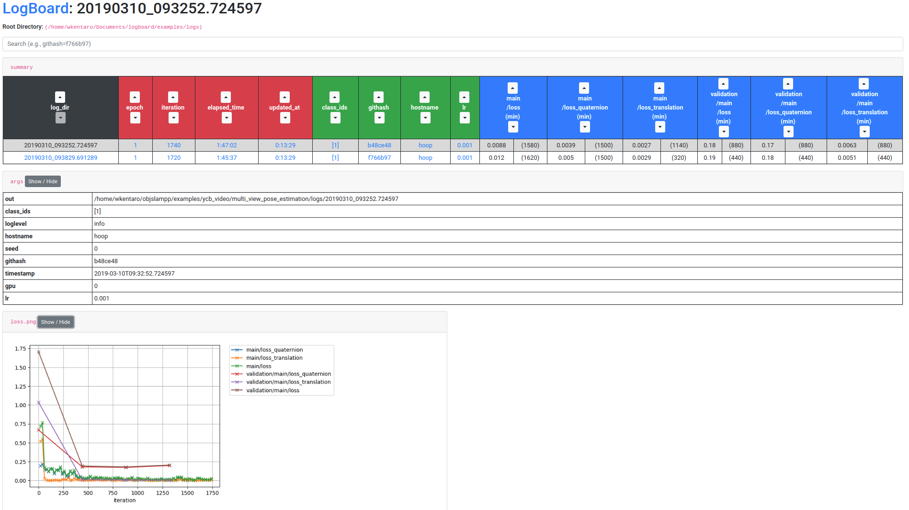

<h1 align="center">
  logboard
</h1>

<h4 align="center">
  Monitor and Compare Logs on Browser.
</h4>

<div align="center">
  <a href="https://travis-ci.com/wkentaro/logboard">
    
  </a>

  <br/>

  
</div>


## Description

Inspired by [tensorboard](https://github.com/tensorflow/tensorboard),
[grip](https://github.com/joeyespo/grip) and [notable](https://github.com/notable/notable),
all of which serve light-weight GUI by

- only using static files (e.g., markdown files without DB);
- single command (e.g., `tensorboard --logdir logs/` and `grip README.md`).


## Why not `tensorboard`?

I also use `tensorboard` in addition to this tool.
But currently `tensorboard` doesn't support comparing different configurations
for each log (e.g., git-hash of the code, learning rate, training strategy).
`logboard` is a kind of extra plugin to `tensorboard`
(but you need to run in different terminal, unfortunately).
I expect this kind of feature will be included in `tensorboard` in the future.


## Usage

```bash
$ cd examples

$ cat logs/20190310_093252.724597/args
{
    "loglevel": "info",
    "gpu": 0,
    "seed": 0,
    "class_ids": [
        1
    ],
    "lr": 0.001,
    "timestamp": "2019-03-10T09:32:52.724597",
    "out": "/home/wkentaro/logboard/examples/logs/20190310_093252.724597",
    "hostname": "computer1",
    "githash": "b48ce48"
}

$ logboard --logdir logs/  # like tensorboard --logdir logs/
```
